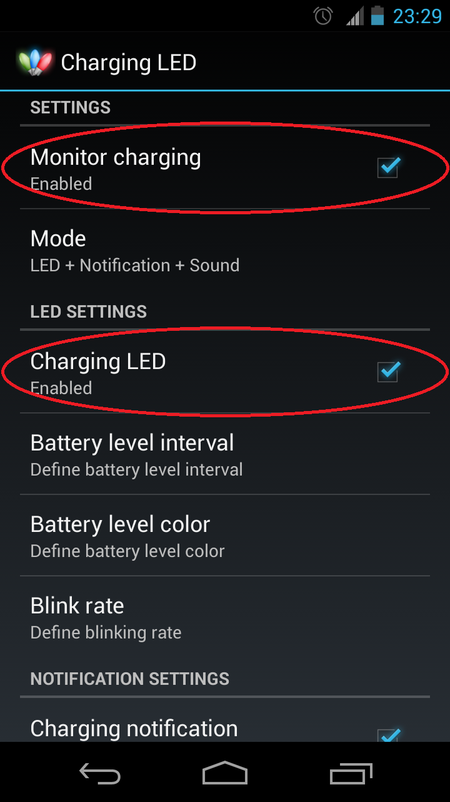
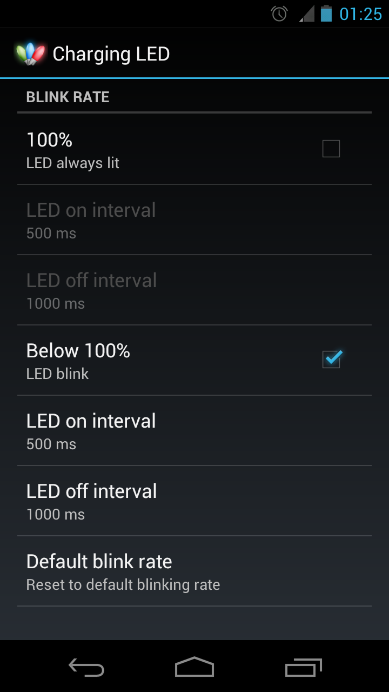

Charging LED
============

     

Battery Charging LED is developed and tested for the Galaxy Nexus, because the phone don't provide any indication during charging. It may works on other phones (NO GUARANTEE).
Once the app is installed and setup, the phone's LED will blink in different colour during charging when screen off (Android constraint).

Features
--------
 - Definable LED colour
 - Definable LED blink rate
 - Definable battery level interval
 - Charging status notification
 - Charging sound notification
 - Import/Export settings (Advanced users can edit the colour hex code in ini file, and import settings for more precise colour)

For users wanting to enter HEX colour code, follow below steps
--------------------------------------------------------------
 1. Export settings to storage
 1. Edit the exported ChargingLED.ini file with required colour code
 1. Import the ChargingLED.ini back to the app

<a href="https://play.google.com/store/apps/details?id=hk.ChargingLED">
  
</a>


License
-------
```
Charging LED - A battery Charging LED app for the Galaxy Nexus.
Copyright (c) 2012-2018 HairyRobot

This program is free software: you can redistribute it and/or modify
it under the terms of the GNU General Public License as published by
the Free Software Foundation, either version 3 of the License, or
(at your option) any later version.

This program is distributed in the hope that it will be useful,
but WITHOUT ANY WARRANTY; without even the implied warranty of
MERCHANTABILITY or FITNESS FOR A PARTICULAR PURPOSE.  See the
GNU General Public License for more details.

You should have received a copy of the GNU General Public License
along with this program.  If not, see <https://www.gnu.org/licenses/>.
```
